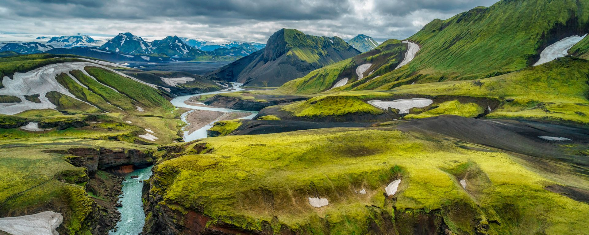
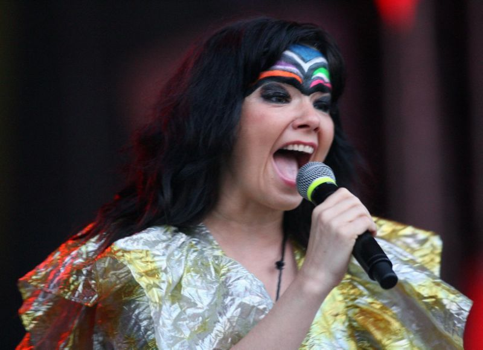

I recently gave a talk at the [GatsbyNYC](https://www.meetup.com/Gatsby-NYC) meetup about doing art direction with images in Gatsby.
I had spoken at this meetup before about working with images in Gatsby and all of the cool stuff 
Gatsby does with your images out-of-the-box.

When I started exploring art direction and building an example site for the talk, I 
realized that there was not an obvious way of supplying alt text to my images. 
Since making inaccessible websites is something bad devs do (and I want to be a good dev), I came up with a solution using state and custom graphql fields.

So, I thought I would share it with you :)

If you want to skip this post and go straight to [the repo](https://github.com/mrkutly/gatsby-nyc-talk-good-example), 
that's fine too. The final example is [hosted here](https://naughty-kare-c652c4.netlify.com/art/best/).

---

## What's art direction?

Not all images will look good at any size. Some images look great when they are really big, but a bit insipid when they are small. Like this sweeping Icelandic landscape:



Others might look great small, but look weird or get grainy large. Like this pic of Björk:



When your website shows **different images** based on **different break points**, this is known as art direction.

---

## How do we do it with Gatsby?

If you have worked with `gatsby-image` before, this will be very familiar to you. If not, I would suggest 
following the documentation [here](https://www.gatsbyjs.org/docs/gatsby-image/) to get setup and learn how to render a single image in Gatsby.

To get our images art-directed with Gatsby, we'll follow these steps:

  1. [Query our images with graphql](#step-1)
  2. [Create an array of image sources](#step-2)
  3. [Pass the array to the `gatsby-image` `jsx~` component](#step-3)

---

## <a name="step-1"></a> Step 1 - Query the Images

```javascript
  // in whatever page will render the images. In my case, /pages/art.js
  import { graphql } from 'gatsby';

  export const icelandImagesQuery = graphql`
    query {
      reynisfjara: file(relativePath: { eq: "reynisfjara.jpg" }) {
        childImageSharp {
          fluid(maxWidth: 1400) {
            ...GatsbyImageSharpFluid
          }
        }
      }

      skogafoss: file(relativePath: { eq: "skogafoss.jpg" }) {
        childImageSharp {
          fluid(maxWidth: 1000) {
            ...GatsbyImageSharpFluid
          }
        }
      }

      bjork: file(relativePath: { eq: "bjork.jpg" }) {
        childImageSharp {
          fluid(maxWidth: 700) {
            ...GatsbyImageSharpFluid
          }
        }
      }
    }
  `;
```

Here, we are querying three images from our filesystem and naming the results `reynisfjara`, `skogafoss`, and `bjork`. We're using
the `GatsbyImageSharpFluid` graphql fragment to get everything we need to create some fluid images. If this part 
is foreign to you, I recommend going through the [documentation](https://www.gatsbyjs.org/docs/gatsby-image/) and practicing
getting some images rendering on your own.

---

## <a name="step-2"></a> Step 2 - Create an Array of Sources

Now that we have our query, our images will be available in our page component's props in the `data` attribute.
First, we let's pull those images out of props:

```jsx
import React from "react";
import Layout from "../../components/layout";
import { graphql } from "gatsby";

export const icelandImagesQuery = graphql`
 ...
`;

export default props => {
  const { reynisfjara, skogafoss, bjork } = props.data;
  
  return (
    <Layout>
      this is where our images will go
    </Layout>
  );
};

```

Now that we have access to all the image data that we need to give to the `jsx~` component, we can create our array of image sources.
Each of the sources is just the result of the `GatsbyImageSharpFluid` fragment with an added `media` property.
The `media` property is going to be a CSS media query that tells the `jsx~` component which image needs to be shown at each breakpoint.

We're going to show these images at the following breakpoints:

  - **Below 701px** - `bjork`
  - **701px to 1000px** - `skogafoss`
  - **Above 1000px** - `reynisfjara`

So, our sources array will look like this:

```javascript 
const { reynisfjara, skogafoss, bjork } = props.data;
const sources = [
  {
    ...bjork.childImageSharp.fluid,
    media: "(max-width: 700px)",
  },
  {
    ...skogafoss.childImageSharp.fluid,
    media: "(min-width: 701px) and (max-width: 1000px)",
  },
  {
    ...reynisfjara.childImageSharp.fluid,
    media: "(min-width: 1001px)",
  },
];
```

Great. Now we have our sources array. Let's go to step 3!

---

## <a name="step-3"></a> Step 3 - Pass the Array to gatbsy-image

Instead of passing a single `fluid` image result to the `jsx~` component as a fluid prop (the way we do for single images),
we will pass the sources array to it instead. So let's import the `jsx~` component from `gatsby-image` and do it!

```jsx 
import React from "react";
import Layout from "../../components/layout";
import { graphql } from "gatsby";
import Img from "gatsby-image";

export const icelandImagesQuery = graphql`
 ...
`;

export default props => {
  const { reynisfjara, skogafoss, bjork } = props.data;
  const sources = [
    {
      ...bjork.childImageSharp.fluid,
      media: "(max-width: 700px)",
    },
    {
      ...skogafoss.childImageSharp.fluid,
      media: "(min-width: 701px) and (max-width: 1000px)",
    },
    {
      ...reynisfjara.childImageSharp.fluid,
      media: "(min-width: 1001px)",
    },
  ];

  return (
    <Layout>
      <h1>See some lovely pictures {":)"}</h1>
      
    </Layout>
  );
};
```

Awesome! We did it. Amazing. We're done, right?

---

## Nope. Not done. Where's your alt text?

Ah crap. We got too fancy and now our website is broken. Since we don't know which image is being shown at any give time,
we can't give it an `alt` attribute. How are we going to deal with this?

Luckily, the `jsx~` component accepts a prop called `onLoad` that is quite useful.
`onLoad` is a callback function that is going to be called any time an image loads.

Because we are super clever React developers, I bet we can use state to track which image is being shown and 
update the alt text accordingly. So let's do that!

First, we setup our state and pass it to the `jsx~` component's `alt` prop:

```jsx
import React, { useState } from "react";
import Layout from "../../components/layout";
import { graphql } from "gatsby";
import Img from "gatsby-image";

export const icelandImagesQuery = graphql`
 ...
`;

export default props => {
  const { reynisfjara, skogafoss, bjork } = props.data;
  const sources = [
    ...
  ];
  const [alt, setAlt] = useState('');

  return (
    <Layout>
      <h1>See some lovely pictures {":)"}</h1>
      
    </Layout>
  );
};
```

Next, we'll use that `onLoad` callback to keep track of what the alt text should be. We'll do this 
by checking the width of the viewport.

```jsx
import React, { useState } from "react";
import Layout from "../../components/layout";
import { graphql } from "gatsby";
import Img from "gatsby-image";

export const icelandImagesQuery = graphql`
 ...
`;

export default props => {
  const { reynisfjara, skogafoss, bjork } = props.data;
  const sources = [
    ...
  ];
  const [alt, setAlt] = useState('');

  return (
    <Layout>
      <h1>See some lovely pictures {":)"}</h1>
       {
          const width = window && window.innerWidth;

          if (width < 701) {
            return setAlt("bjork singing");
          }

          if (width < 1001) {
            return setAlt("skogafoss waterfall");
          }

          setAlt("reynisfjara black sand beach");
        }}
      />
    </Layout>
  );
};
```

Nice. Crisis averted. Now, our art-directed images have alt text.

---

## Now Are We Done?

Probably not. We solved our problem, but what if we want to reuse those images elsewhere in our project?
All of the alt texts are just hardcoded in our page component. That means we have to re-write those alt 
texts every time we use those images!

If only there were some way we could **_attach_** the alt text to those images themselves. That way, any time 
we **_query_** the image, the alt text would come along for the ride.

---

## Creating Custom Fields in gatsby-node.js 

Turns out we can do exactly that using the `onCreateNode` function in the `gatsby-node.js` file.
This function is going to get run once as each node on our graph is created. This means any images, markdown files,
json files - anything setup as part of our data-layer - is going to trigger this function.

A super handy use of this `onCreateNode` function is to attach custom fields to our nodes. So for our 
images, we can attach alt text to them and that alt text can be **_written once_** and **_used anywhere_**.

So first, let's just create a basic config object for our images:

```javascript 
// in gatsby-node.js 

const imageConfigs = {
  reynisfjara: {
    alt: "Reynisfjara black sand beach",
  },
  bjork: {
    alt: "Bjork Singing",
  },
  skogafoss: {
    alt: "Skogafoss Waterfall with green grass",
  },
};

```

Normally, I would put this in its own file and import it into `gatsby-node.js`, but for simplicity's sake,
we'll leave it in here for now.

Next, we can use the `onCreateNode` function to attach these configs to the images:

```javascript
const imageConfigs = {
  reynisfjara: {
    alt: "Reynisfjara black sand beach",
  },
  bjork: {
    alt: "Bjork Singing",
  },
  skogafoss: {
    alt: "Skogafoss Waterfall with green grass",
  },
};

exports.onCreateNode = ({ node, actions }) => {
  // check that the node is an image
  if (node.internal.type === 'ImageSharp' && node.name in imageConfigs) {
    const { createNodeField } = actions;
    // create the custom alt field
    createNodeField({
      node,
      name: "alt",
      value: imageConfigs[node.name].alt,
    });
  }
};
```

Now, each of our images has an alt text attached to it. This means that when we query the images with
a graphql query, the alt text can come along for the ride.

Let's rewrite our `icelandImagesQuery` from earlier:


```javascript
  import { graphql } from 'gatsby';

  export const icelandImagesQuery = graphql`
    query {
      reynisfjara: file(relativePath: { eq: "reynisfjara.jpg" }) {
        childImageSharp {
          fluid(maxWidth: 1400) {
            ...GatsbyImageSharpFluid
          }
        }
        fields {
          alt
        }
      }

      skogafoss: file(relativePath: { eq: "skogafoss.jpg" }) {
        childImageSharp {
          fluid(maxWidth: 1000) {
            ...GatsbyImageSharpFluid
          }
        }
        fields {
          alt
        }
      }

      bjork: file(relativePath: { eq: "bjork.jpg" }) {
        childImageSharp {
          fluid(maxWidth: 700) {
            ...GatsbyImageSharpFluid
          }
        }
        fields {
          alt
        }
      }
    }
  `;
```

Great! Now let's use that in place of our hard-coded alt texts.

```jsx
import React, { useState } from "react";
import Layout from "../../components/layout";
import { graphql } from "gatsby";
import Img from "gatsby-image";

export const icelandImagesQuery = graphql`
 ...
`;

export default props => {
  const { reynisfjara, skogafoss, bjork } = props.data;
  const sources = [
    ...
  ];
  const [alt, setAlt] = useState('');

  return (
    <Layout>
      <h1>See some lovely pictures {":)"}</h1>
       {
          const width = window && window.innerWidth;

          if (width < 701) {
            return setAlt(bjork.fields.caption);
          }

          if (width < 1001) {
            return setAlt(skogafoss.fields.caption);
          }

          setAlt(reynisfjara.fields.caption);
        }}
      />
    </Layout>
  );
};
```

---

## Thanks :)

That's all. Thanks for reading! Migwech n'nikanek <3
